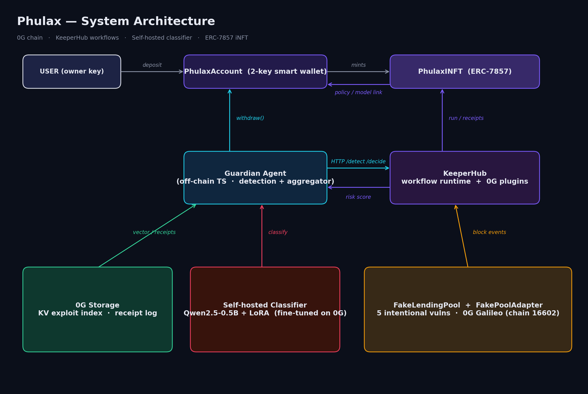
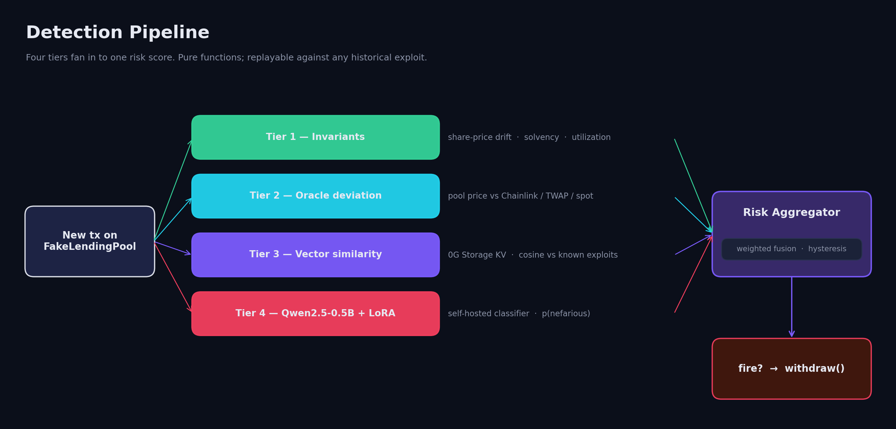
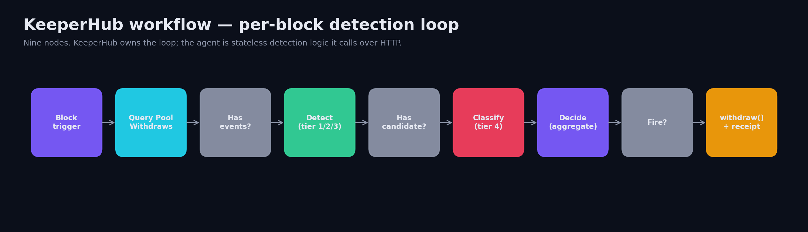
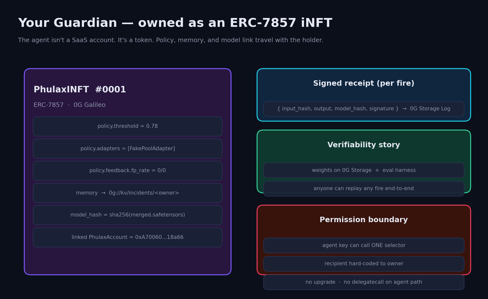

<div align="center">

# Phulax

### *Protect. Detect. Withdraw.*

**An autonomous on-chain guardian agent that watches your yield position, detects exploits in real time, and pulls your funds out before the attacker drains the pool.**

[](https://chainscan-galileo.0g.ai/) [](https://keeperhub.com/) [](#owned-as-an-inft) [](LICENSE)

</div>

---

## TL;DR

> A user deposits into a yield pool. Phulax watches every Galileo block. The instant a transaction matches a known exploit pattern — or scores high on a fine-tuned classifier — the guardian fires `withdraw()` on the user's smart wallet and the funds return to the owner before the drain settles. **The agent key can call exactly one function.** The contract enforces it.

| | |
|---|---|
| **Detection** | 4-tier pipeline: invariants → oracle deviation → vector similarity (0G Storage KV) → Qwen2.5-0.5B + LoRA classifier |
| **Orchestration** | KeeperHub workflow fires every Galileo block; calls our detector and the classifier over HTTP, then signs the withdraw |
| **Verifiability** | Every fire emits a HMAC-signed `(input_hash, output, model_hash)` receipt to a 0G Storage Log |
| **Ownership** | Each guardian is minted as an **ERC-7857 iNFT** — policy, memory, and model link travel with the holder |
| **Live on** | 0G Galileo testnet (chain id **16602**) |

---

## Architecture



Six tracks, six top-level packages — each one is a single, focused surface:

| Track | Path | What it is |
|------:|------|------------|
| A | [`keeperhub/`](keeperhub/) | Our fork of KeeperHub on `feature/0g-integration`. Adds 0G as a chain, plus first-class `0g-storage` and `0g-compute` plugins |
| B | [`contracts/`](contracts/) | Foundry: `PhulaxAccount`, `Hub`, `PhulaxINFT` (ERC-7857), `FakeLendingPool` with **5 intentional vulns** (each backed by a forge exploit test) |
| C | [`ml/`](ml/) | Offline pipeline (uv): dataset builder, frozen prompt, LoRA fine-tune, merge + quantize, embeddings indexer, eval harness, 0G Storage upload |
| D | [`inference/`](inference/) | FastAPI classifier endpoint. Real merged Qwen2.5-0.5B + LoRA when `PHULAX_MODEL_DIR` is set; deterministic stub otherwise. HMAC receipts on every fire |
| E | [`agent/`](agent/) | TypeScript guardian (Node 20, viem, fastify). Detection pipeline + risk aggregator + KeeperHub workflow client + withdraw executor + SSE log stream |
| F | [`web/`](web/) | Next.js 14 dashboard: connect → position → live risk gauge (SSE) → streaming logs → incident timeline |

Plus [`tools/finetune/`](tools/finetune/) — a separate workspace driving the 0G fine-tuning broker, deliberately isolated from the agent runtime so the **single-signer invariant** holds (only `agent/src/exec/withdraw.ts` ever signs at runtime).

---

## How detection works



Four tiers, ranked by signal-to-noise. Pure functions — `detect(tx, ctx) -> Score` has zero side effects, so any historical exploit can be replayed through it as a regression test.

1. **Invariants** — share-price monotonicity, solvency, utilization. Fastest, cheapest, hardest to fool.
2. **Oracle deviation** — pool's read price vs Chainlink / DEX TWAP / spot. Catches the Mango / Cream / Inverse class directly.
3. **Vector similarity** — embed the calldata + state delta, cosine against an index of historical exploits stored on **0G Storage KV**. Catches mutations of known patterns.
4. **Classifier** — a Qwen2.5-0.5B base + LoRA adapter, fine-tuned on a labelled nefarious-vs-benign corpus. Returns `p_nefarious`. Picks up novel patterns the vector tier misses.

The aggregator fuses all four into a single risk score with hysteresis. Cross the threshold → fire.

---

## The KeeperHub workflow



Nine nodes, exported as [`workflows/phulax-guardian.workflow.json`](workflows/phulax-guardian.workflow.json). KeeperHub owns the loop; the agent is stateless logic it calls over HTTP.

The detection pattern is **`Block` trigger + `web3/query-events` filter** — locked in `tasks/todo.md` §7.4. Don't write a per-tx trigger from scratch.

Every `withdraw()` is paired with a `0g-storage/log-append` step that writes the signed receipt — that's the verifiability story turned into a workflow node.

---

## Owned as an iNFT



The agent isn't a SaaS account. It's a **token** — an ERC-7857 iNFT minted per user. Policy, memory, and the model pointer travel with the holder. If you transfer the iNFT, the new owner inherits the guardian.

This is also where the verifiability story lives:
- **Weights** are published on 0G Storage with their sha256.
- **Eval harness** is checked in.
- **Every fire** writes a HMAC-signed `(input_hash, output, model_hash, signature)` receipt to a 0G Storage Log.

You don't have to trust us. You can replay any decision end-to-end.

---

## Live deployment (0G Galileo, chain id 16602)

| Contract | Address |
|----------|---------|
| **Hub** | [`0x573b9Ec4BB93bbDA59C0DBA953831d58fC36498C`](https://chainscan-galileo.0g.ai/address/0x573b9Ec4BB93bbDA59C0DBA953831d58fC36498C) |
| **PhulaxINFT** (ERC-7857) | [`0xe5c3e4b205844EFe2694949d5723aa93B7F91616`](https://chainscan-galileo.0g.ai/address/0xe5c3e4b205844EFe2694949d5723aa93B7F91616) |
| **FakeLendingPool** | [`0xb1DE7278b81e1Fd40027bDac751117AE960d8747`](https://chainscan-galileo.0g.ai/address/0xb1DE7278b81e1Fd40027bDac751117AE960d8747) |
| **DemoAsset** (pUSD) | [`0x21937016d3E3d43a0c2725F47cC56fcb2B51d615`](https://chainscan-galileo.0g.ai/address/0x21937016d3E3d43a0c2725F47cC56fcb2B51d615) |
| **FakePoolAdapter** | [`0x0c39fF914e41DA07B815937ee70772ba21A5C760`](https://chainscan-galileo.0g.ai/address/0x0c39fF914e41DA07B815937ee70772ba21A5C760) |
| **PhulaxAccount** | [`0xA70060465c1cD280E72366082fE20C7618C18a66`](https://chainscan-galileo.0g.ai/address/0xA70060465c1cD280E72366082fE20C7618C18a66) |
| **Agent EOA** | [`0x47d3CF2a314aeF4Da43dB8eBC7Eb818bF2496260`](https://chainscan-galileo.0g.ai/address/0x47d3CF2a314aeF4Da43dB8eBC7Eb818bF2496260) |

Broadcast log: [`contracts/broadcast/Deploy.s.sol/16602/run-latest.json`](contracts/broadcast/Deploy.s.sol/16602/run-latest.json).

---

## Architectural invariants (do not violate)

These come from `tasks/todo.md` §3 and §5. They are non-negotiable.

- **Agent never holds user funds.** `PhulaxAccount.withdraw` is hard-coded to send to `owner`; no `to` parameter, no agent-controlled recipient.
- **Agent key has one selector.** The agent role can call `withdraw(adapter)` and nothing else. No upgradability, no `delegatecall`, no escape hatch on the agent path. **Fuzz-tested across 512 runs / 256k invariant calls.**
- **Two signing surfaces in the repo, not one.** The runtime container has only `agent/src/exec/withdraw.ts`. The offline 0G fine-tuning broker driver in `tools/finetune/` uses a separate `PHULAX_FT_PRIVATE_KEY` — different workspace, different key.
- **Detection pipeline is pure.** `detect(tx, ctx) -> Score` has no side effects, so any historical exploit can be replayed through it as a regression test.
- **No database in `agent/`.** 0G Storage (KV + Log) is the database. This is part of the pitch.
- **One canonicaliser for `input_hash`.** Inference server and agent both compute `sha256(canonical_json(features))` with sorted keys and `(",", ":")` separators.
- **Frozen prompt template.** `ml/prompt/template.py` carries `TEMPLATE_VERSION` and is imported by fine-tune, eval, and inference. Bumping the version invalidates published weights.

---

## Quickstart

```bash
# clone with submodules (KeeperHub fork lives in keeperhub/)
git clone --recurse-submodules <repo-url> phulax
cd phulax

# install everything
pnpm install

# run the agent + classifier + KeeperHub locally
docker compose up

# in another terminal, fire the dashboard
pnpm --filter @phulax/web dev
# open http://localhost:3000
```

Per-package commands live in each package's `README.md` and in [`CLAUDE.md`](CLAUDE.md). The 0G ↔ KeeperHub bridge lives in [`keeperhub/`](keeperhub/) on the `feature/0g-integration` branch — follow [`keeperhub/CLAUDE.md`](keeperhub/CLAUDE.md) inside that submodule.

### Re-rendering the diagrams

```bash
python3 scripts/render_diagrams.py
```

Outputs the four PNGs in `docs/img/`. Pure matplotlib — no graphviz / mermaid required.

---

## The demo

> "Here's our fake Aave-inspired lending pool with a Phulax-protected position in it. An attacker submits a draining transaction. Same Galileo block — KeeperHub picks it up. Invariants flag the share-price collapse. Oracle tier sees a 12% deviation. Vector similarity to a known Mango-class exploit. Classifier returns `p_nefarious=0.94`. Aggregator says fire.
>
> The agent calls `withdraw`. The contract sends the funds straight back to the owner — there is no other path. The attacker's tx still lands. The pool still drains. We're just not in it anymore."

Full script in [`VIDEO_SCRIPT.md`](VIDEO_SCRIPT.md). Three acts, under three minutes.

---

## What's in this repo

```
phulax/
├── contracts/        — Foundry: PhulaxAccount, Hub, INFT, FakeLendingPool (5 vulns)
├── agent/            — TS guardian: detection + aggregator + executor + SSE
├── inference/        — FastAPI classifier (Qwen2.5-0.5B + LoRA + HMAC receipts)
├── ml/               — Python pipeline: dataset, fine-tune, eval, 0G upload
├── tools/finetune/   — 0G fine-tuning broker driver (separate signer)
├── web/              — Next.js 14 dashboard
├── keeperhub/        — submodule: KeeperHub fork with 0G integration
├── workflows/        — KeeperHub workflow JSON exports
├── docs/img/         — architecture diagrams (this README)
├── scripts/          — render_diagrams.py + helpers
├── STRATEGY.md       — what & why  (architecture, scope, demo)
├── tasks/todo.md     — how & in what order  (build plan, sharp edges)
├── VIDEO_SCRIPT.md   — 3-min demo script
└── CLAUDE.md         — coding rules + sharp edges for contributors
```

---

## Sharp edges (will bite if missed)

A short version of `CLAUDE.md` § "Sharp edges":

- **Galileo chain id is `16602`, not 16601.** Some seeds were committed before the 0G migration; current code is on 16602.
- **2 gwei minimum priority fee** on Galileo. `forge --broadcast` and `cast send` both need `--priority-gas-price 2gwei` or the relay rejects with `gas tip cap 1, minimum needed 2000000000`.
- **0G WSS is `wss://evmrpc-testnet.0g.ai/ws/`** — trailing slash mandatory. `/ws` (no slash) returns an HTTP 301 that WebSocket clients silently fail on.
- **Adapter owns the pool position, not PhulaxAccount.** After the 2026-04-26 ownership-model fix, `pool.balanceOf(asset, user)` returns 0; read `adapter.balanceOf(account)` instead.
- **`@0glabs/0g-serving-broker` requires an `ethers.Wallet`, not a `JsonRpcSigner`** — `broker.fineTuning` is undefined otherwise.
- **0G fine-tuning config schema is rigid** — exactly `{neftune_noise_alpha, num_train_epochs, per_device_train_batch_size, learning_rate, max_steps}`, decimal notation only.
- **Pydantic v2 reserves `model_`** — `inference/server.py` keeps the `model_hash` field name by setting `ConfigDict(protected_namespaces=())`.

Full list — including 0G Storage Flow contract address and broker setup — in [`CLAUDE.md`](CLAUDE.md).

---

## What's cut from v1

Explicitly:

- ❌ **x402 / MPP autonomous payment** — one-line roadmap mention only.
- ❌ **Multi-chain** — 0G Galileo for the demo.
- ❌ **Fancy frontend** — one screen. The streaming logs panel is the credibility moment.
- ❌ **FakeLendingPool as a KeeperHub `protocols/` plugin** — it's a deployed demo contract, consumed via `abi-with-auto-fetch`.
- ❌ **Governance / admin-key tier of detection** — roadmap, not built.

Why: per `STRATEGY.md` §8, the single most important thing was that the 0G ↔ KeeperHub bridge land on Day 1. Anything that competed for time on Day 1 was treated as a distraction.

---

## Built with

- **0G** — chain (Galileo testnet), Storage (KV + Log), Compute (sealed-inference slot), fine-tuning broker
- **KeeperHub** — workflow runtime, private routing, retry, gas optimisation
- **Foundry** — contracts + fuzz invariants
- **Qwen2.5-0.5B** — base classifier model
- **PEFT / LoRA** — adapter fine-tuning
- **viem + fastify + Next.js 14** — agent + dashboard
- **FastAPI + transformers** — classifier endpoint
- **uv** — Python toolchain for `ml/`

---

<div align="center">

**Phulax** — Greek φύλαξ, *guardian*.

*Built for the 0G x KeeperHub hackathon, 2026.*

</div>
