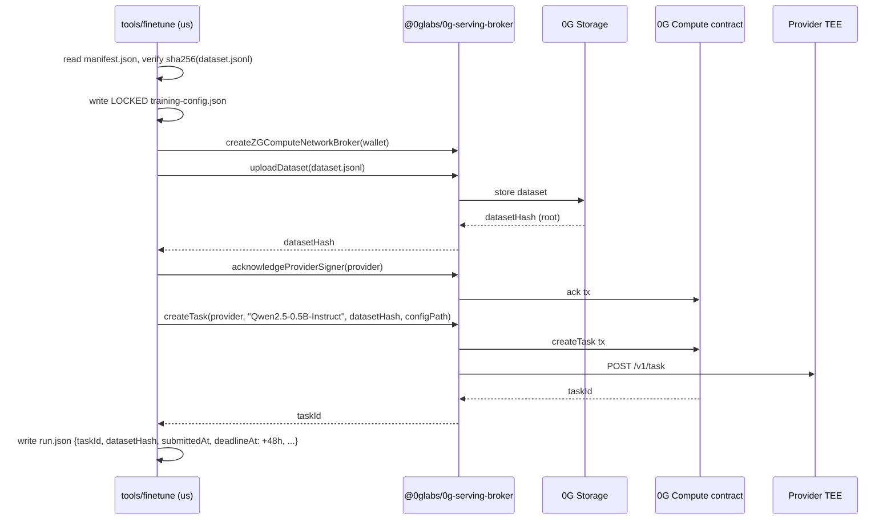

# How to fine-tune and serve the Phulax classifier

End-to-end runbook for taking the labelled exploit dataset, fine-tuning `Qwen2.5-0.5B-Instruct` on **0G Compute**, merging the LoRA adapter, and serving the result behind the `inference/` endpoint that the agent's KeeperHub workflow already calls.

The design rationale (why 0G, why publish-and-replay instead of TEE-sealed inference, why the model is self-hosted) lives in `tasks/todo.md` §10 and §10.1. This file is the *how*, not the *why* — read it linearly.

---

## 1. What this gets you

```
labelled txns (~200) ──► fine-tuned LoRA adapter ──► merged Q4 GGUF ──► self-hosted /classify endpoint
       (offline)         (LoRA on 0G Compute)       (offline)             (FastAPI / llama.cpp)
                                                                                  │
                                                                                  ▼
                                                              KeeperHub workflow HTTP step
                                                                  signed receipt to 0G Storage Log
```

A merged classifier returns `{p_nefarious, tag}` plus an HMAC receipt. The receipt anchors back to the 0G-published merged weights, dataset sha256, and prompt template version, so any third party can replay every fire.

---

## 2. Architecture at a glance

```
┌────────────────────────── offline ─────────────────────────────┐    ┌─── 0G Compute (TEE) ───┐    ┌── runtime ──┐
│                                                                │    │                        │    │             │
│  ml/data/build_dataset.py    ──► data/dataset.jsonl            │    │                        │    │             │
│              │                                                 │    │                        │    │             │
│              ▼                                                 │    │                        │    │             │
│  ml/finetune/og_emit.py      ──► artifacts/og-ft/dataset.jsonl │    │                        │    │             │
│                                  artifacts/og-ft/manifest.json │    │                        │    │             │
│                                            │                   │    │                        │    │             │
│                                            ▼                   │    │                        │    │             │
│                          tools/finetune/  submit  ─────────────┼───►│ uploadDataset          │    │             │
│                                              │                 │    │   ─ datasetHash        │    │             │
│                                              ▼                 │    │ acknowledgeProvider    │    │             │
│                                          run.json              │    │ createTask             │    │             │
│                                              │                 │    │   ─ taskId             │    │             │
│                                              ▼                 │    │ provider trains LoRA   │    │             │
│                          tools/finetune/  poll ────────────────┼───►│ getTask (Finished)     │    │             │
│                          tools/finetune/  ack  ────────────────┼───►│ acknowledgeModel       │    │             │
│                                              │                 │    │ decryptModel           │    │             │
│                                              ▼                 │    │                        │    │             │
│                          ml/artifacts/lora/adapter.safetensors │    │                        │    │             │
│                                              │                 │    │                        │    │             │
│                                              ▼                 │    │                        │    │             │
│  ml/finetune/merge_and_quantize.py  ──► artifacts/merged/      │    │                        │    │             │
│                                          phulax-q4.gguf        │    │                        │    │             │
│                                              │                 │    │                        │    │             │
│                                              ▼                 │    │                        │    │             │
│  ml/eval/harness.py                 ──► eval/REPORT.md         │    │                        │    │             │
│                                              │                 │    │                        │    │             │
│                                              ▼                 │    │                        │    │             │
│  ml/upload/og_storage.py            ──► artifacts.json (CIDs)  │    │                        │    │             │
│                                              │                 │    │                        │    │             │
└──────────────────────────────────────────────┼─────────────────┘    └────────────────────────┘    │             │
                                               │                                                    │             │
                                               ▼                                                    ▼             │
                             inference/server.py loads merged GGUF;  POST /classify ───►  agent + KeeperHub      │
                             logs model_hash at boot; HMACs every                                                │
                             (input_hash, output, model_hash) receipt.                                           │
                                                                                                   └─────────────┘
```

The dashed boundary on the right is the only piece that runs in the demo's hot path. Everything above it is a pre-flight you do once per model version.

---

## 3. Prerequisites

| Thing | Where | Notes |
|---|---|---|
| `pnpm install` clean | repo root | Pulls workspace deps incl. `tools/finetune`. |
| `uv sync` clean | `ml/` | Pulls Python deps for dataset + train + eval. |
| Funded 0G testnet wallet | env | `PHULAX_FT_PRIVATE_KEY`. **Must not equal the agent runtime key** (the one that calls `PhulaxAccount.withdraw`). Budget ≈0.2 0G for a single Qwen2.5-0.5B run. |
| Provider address | env | `PHULAX_FT_PROVIDER`, pinned per run. Discover with the CLI (step 4). |
| `LLAMA_CPP_DIR` | env | Path to a built `llama.cpp` checkout (used by `merge_and_quantize`). |
| `inference/` requirements | `inference/` | `pip install -r requirements.txt` and a runtime HMAC key in `PHULAX_INFERENCE_HMAC_KEY`. |

Copy `ml/.env.example` to `ml/.env`, then export the variables in your shell session before starting.

---

## 4. Run order

Each step is one command. Steps 1–2 stay local; step 3 is read-only RPC; steps 4–8 spend 0G; steps 9–11 stay local; step 12 boots the inference server.

### Step 1 — Build the labelled dataset (Python)

```bash
cd ml
uv run python -m data.build_dataset       # → ml/data/dataset.jsonl
```

Pulls 50 nefarious + 150 benign canonicalised rows. Schema is `{selector, fn, decoded_args, balance_delta, label}` where label is `RISK` or `SAFE`.

### Step 2 — Emit 0G-shape JSONL (Python)

```bash
uv run python -m finetune.og_emit         # → ml/artifacts/og-ft/{dataset.jsonl, manifest.json}
```

Renders each row through the **frozen** `ml/prompt/template.py` (folds `SYSTEM` into `instruction`, canonicalised features into `input`, target JSON into `output`). The manifest carries `{rows, sha256, template_version, base_model, label_distribution, built_at}` — `submit` cross-checks the sha256 against the file before upload.

If you ever change the prompt template, **bump `TEMPLATE_VERSION`** — it invalidates already-published weights and the `submit` step refuses to proceed if the sha drifts.

### Step 3 — Discover providers (TS, read-only)

```bash
cd ..
pnpm --filter @phulax/finetune discover
```

Lists every fine-tuning provider on the contract with availability and price-per-byte. Pin one in `.env` (the canonical source — every subcommand reads `.env` automatically):

```bash
# in .env at the repo root (or ml/.env)
PHULAX_FT_PROVIDER=0xPROVIDER_ADDRESS_HERE
```

We pin (rather than auto-pick) because the publish-and-replay receipt records `provider` — switching providers mid-run breaks reproducibility.

> **Don't** pass `--provider $PHULAX_FT_PROVIDER` on the CLI: that env var lives in `.env` and isn't exported to your shell, so the shell expansion produces an empty string. Just omit `--provider` and let the tool resolve it from `.env`.

### Step 4 — Fund (TS, idempotent)

```bash
pnpm --filter @phulax/finetune fund
```

Three on-chain steps, each guarded by a balance check so re-runs don't double-pay:

1. `addLedger` (or `depositFund`) until main ledger ≥ 3.0 0G (testnet minimum).
2. `acknowledgeProviderSigner` for the chosen provider.
3. `transferFund` until the provider sub-account ≥ 0.5 0G.

Tune the targets via `--ledger 3.0 --sub-account 0.5` if you need more headroom. Override the provider for one run with `--provider 0x…` (CLI flag wins over `.env`).

### Step 5 — Submit (TS)

```bash
pnpm --filter @phulax/finetune submit
```

This is the broker handshake — five contract/RPC interactions in one command:



`run.json` is the single source of truth for every step that follows.

The locked training config:

```json
{
  "neftune_noise_alpha": 5,
  "num_train_epochs": 3,
  "per_device_train_batch_size": 2,
  "learning_rate": 0.0002,
  "max_steps": 480
}
```

These are the **only** keys 0G's surface accepts. Adding/removing keys silently fails the job. The schema lives in `tools/finetune/src/config.ts` — change it there or nowhere.

### Step 6 — Safety watchdog (TS, in parallel)

In a second terminal:

```bash
pnpm --filter @phulax/finetune safety-cron
```

This long-running process polls `run.json`. At `submittedAt + 47h`, if `acknowledgedAt` is still null, it forces `ack`. Defends the 30%-fee penalty + model-loss on the 48h hard deadline.

You can skip this only if you're sure the job will finish well under 24h *and* you'll be at the keyboard. For overnight runs, run it.

### Step 7 — Poll (TS)

Back in the first terminal:

```bash
pnpm --filter @phulax/finetune poll
```

Prints progress on every state change, blocks until terminal. Default cadence is 30s; bump to 60s on slow networks via `--interval 60`.

```
run.json status lifecycle (driven by tools/finetune):

   ┌──────────┐        ┌──────────┐        ┌──────────────┐        ┌─────────────┐
   │ submit   │───────►│ poll     │───────►│ ack          │───────►│ decrypt     │
   │ (taskId) │        │(progress)│        │(acknowledged)│        │(decryptedAt)│
   └──────────┘        └──────────┘        └──────────────┘        └─────────────┘
        │                   │                     │                      │
        │      Failed       │      timeout        │   (auto by           │
        ▼                   ▼                     │   safety-cron        ▼
   getLog + cancelTask  re-run poll              │   if missed)      adapter.safetensors
                                                  │                      ready for merge
                                                  ▼
                                           encrypted/<taskId>.bin
```

### Step 8 — Ack + decrypt (TS, idempotent)

```bash
pnpm --filter @phulax/finetune ack
```

Two broker calls, both safe to re-run:

1. `acknowledgeModel(provider, taskId, dataPath)` — downloads the encrypted artefact (default `downloadMethod: "auto"` tries 0G Storage then TEE), and writes the on-chain ack. This is what trips the 48h deadline.
2. `decryptModel(provider, taskId, encryptedPath, decryptedPath)` — derives the symmetric key from the on-chain `encryptedSecret` and writes `ml/artifacts/lora/adapter_model.safetensors`.

If `run.json.acknowledgedAt` is already set, ack skips the re-download. If `run.json.decryptedAt` is set, decrypt is skipped. Re-runs are no-ops.

### Step 9 — Merge + quantize (Python)

```bash
cd ml
uv run python -m finetune.merge_and_quantize    # → artifacts/merged/{,*.safetensors,phulax-q4.gguf}
```

PEFT `merge_and_unload` over base Qwen2.5-0.5B-Instruct + the adapter, then `llama.cpp/convert-hf-to-gguf.py` and `quantize` to Q4_K_M. Output is ~400 MB, CPU-servable at sub-second latency.

### Step 10 — Eval (Python)

```bash
MODEL_DIR=./artifacts/mergeduv uv run python -m eval.harness                   # → eval/REPORT.md
```

Runs the holdout split through the merged model **using the same `prompt/template.py`** as training (this is why the template is frozen — drift between train and eval makes the numbers meaningless).

Gate from `tasks/todo.md` §10: ≥0.8 precision @ ≥0.6 recall. Below the gate, drop the classifier from the live aggregator and ship vector-similarity + invariants only — don't silently downgrade.

### Step 11 — Publish to 0G Storage (Python)

```bash
uv run python -m upload.og_storage              # → artifacts.json with CIDs
```

Uploads `merged/`, `adapter_model.safetensors`, `dataset.jsonl`, `manifest.json`, `run.json`, `eval/REPORT.md` to 0G Storage. Records every CID in `ml/artifacts.json` — this is the handoff to `inference/` (Track D), the agent (Track E), and the iNFT metadata.

### Step 12 — Serve (Python, runtime)

```bash
cd ../inference
export PHULAX_INFERENCE_HMAC_KEY=$(openssl rand -hex 32)
pip install -r requirements.txt
uvicorn server:app --host 0.0.0.0 --port 8000
```

On boot the server:

1. Resolves `phulax-q4.gguf` (either from `ml/artifacts/merged/` for local dev or pulled from the 0G CID at deploy time).
2. Computes and logs `model_hash = sha256(GGUF)`.
3. Reads `template_version` from `ml/prompt/template.py`.

Every `POST /classify` returns:

```json
{
  "p_nefarious": 0.91,
  "tag": "RISK",
  "model_hash": "abc…",
  "input_hash": "sha256(canonical_features)",
  "template_version": "1.0.0",
  "signature": "hmac-sha256(model_hash || input_hash || output)"
}
```

The agent and the KeeperHub workflow both call this endpoint via the existing **HTTP Request** step. No new plugin needed; the 0G Compute KeeperHub plugin still ships in the upstream PR for users on 0G-served base models.

---

## 5. End-to-end sanity check

After step 12 is up:

```bash
curl -s -X POST http://localhost:8000/classify \
  -H 'content-type: application/json' \
  -d '{"selector":"0xa9059cbb","fn":"transfer","decoded_args":{"to":"0xabc","amount":"1000"},"balance_delta":"-1000"}' | jq
```

You should see all four fields (`p_nefarious`, `tag`, `model_hash`, `signature`). If `model_hash` matches the value `upload.og_storage` recorded in `artifacts.json`, the publish-and-replay loop is closed.

For a regression test, replay any fixture in `agent/test/fixtures/exploits.ts` against the same endpoint — the classifier output should match what the fixture asserts on its tier.

---

## 6. Troubleshooting

| Symptom | Likely cause | Fix |
|---|---|---|
| `submit` errors with `dataset sha256 drift` | Edited `dataset.jsonl` after `og_emit` ran | Re-run `python -m finetune.og_emit` then `submit` |
| `submit` errors with `broker.fineTuning is undefined` | Signer is a `JsonRpcSigner`, not a `Wallet` | Use `PHULAX_FT_PRIVATE_KEY`, not a custodial signer |
| `createTask` reverts | Sub-account balance < estimated fee | `pnpm fund -- --provider <X> --sub-account 1.0` and retry |
| `poll` hits `Failed` | Provider rejected the config | Check `pnpm exec tsx src/cli.ts status`'s log; usually a forbidden config key crept in |
| `ack` fails with timeout | Encrypted artefact still propagating | Wait 60s and re-run; ack is idempotent |
| 48h deadline elapsed | `safety-cron` wasn't running | 30% penalty applied, model lost. Re-`submit`; for next run, **always** start `safety-cron` |
| Eval below gate | Underfitting or label noise | Curate more nefarious examples; re-train. Don't lower the gate |
| `model_hash` mismatch at runtime | Inference server has a stale GGUF | Re-pull from CID, restart server |

---

## 7. What lives where

| Artefact | Path | Produced by | Consumed by |
|---|---|---|---|
| Labelled dataset | `ml/data/dataset.jsonl` | `data.build_dataset` | `finetune.og_emit`, `finetune.lora` (local), `eval.harness` |
| 0G JSONL + manifest | `ml/artifacts/og-ft/{dataset.jsonl, manifest.json}` | `finetune.og_emit` | `tools/finetune/submit` |
| Locked training config | `ml/artifacts/og-ft/training-config.json` | `tools/finetune/submit` | provider |
| Run state | `ml/artifacts/og-ft/run.json` | `tools/finetune/submit` | every other `tools/finetune` command |
| Encrypted adapter | `ml/artifacts/og-ft/encrypted/<taskId>.bin` | `tools/finetune/ack` | `tools/finetune/ack` (decrypt phase) |
| Decrypted LoRA adapter | `ml/artifacts/lora/adapter_model.safetensors` | `tools/finetune/ack` | `finetune.merge_and_quantize` |
| Merged + quantized GGUF | `ml/artifacts/merged/phulax-q4.gguf` | `finetune.merge_and_quantize` | `inference/server.py`, `upload.og_storage` |
| Eval report | `ml/eval/REPORT.md` | `eval.harness` | gate check, `upload.og_storage` |
| Published CIDs | `ml/artifacts.json` | `upload.og_storage` | `inference/`, agent iNFT metadata |
| Per-fire receipt | 0G Storage Log entry | `inference/` on every fire | third-party replay |

---

## 8. One-shot script

For the demo, the whole thing collapses to:

```bash
# pre-flight
pnpm install && (cd ml && uv sync) && (cd inference && pip install -r requirements.txt)
export PHULAX_FT_PRIVATE_KEY=0x...    # NOT the agent runtime key
export PHULAX_FT_PROVIDER=0x...       # from `pnpm --filter @phulax/finetune discover`

# fund + dataset + remote train (lora.run_remote_0g chains og_emit → fund → submit → poll → ack)
( cd ml && uv run python -m data.build_dataset )
pnpm --filter @phulax/finetune safety-cron &
( cd ml && uv run python -m finetune.lora )

# post-train: merge, eval, publish
( cd ml && uv run python -m finetune.merge_and_quantize \
        && uv run python -m eval.harness \
        && uv run python -m upload.og_storage )

# serve
( cd inference && PHULAX_INFERENCE_HMAC_KEY=$(openssl rand -hex 32) uvicorn server:app --host 0.0.0.0 --port 8000 )
```

The driver inside `ml/finetune/lora.py` shells the TS workspace under the hood when `PHULAX_FT_PROVIDER` is set — same effect as running each `pnpm --filter @phulax/finetune` step by hand, but in one place.
